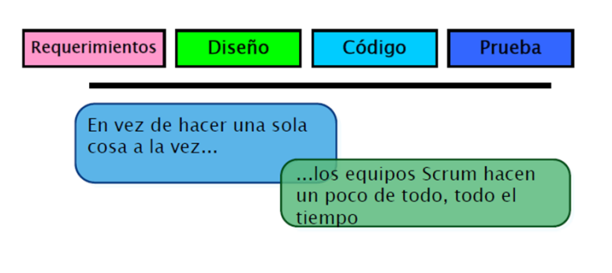

# SCRUM
## Definición
Es un marco de trabajo a través del cual las personas pueden abordar problemas complejos adaptativos, a la vez que se entregan productos de forma eficiente y creativa con el máximo valor.
El modelo Scrum, se encuentra basado en lo que es el desarrollo incremental, es decir, conforme pasen las fases y las iteraciones, mayor va a ser el tamaño del proyecto que se esté desarrollando, es por eso por lo que uno de los principales requisitos para llevarlo a cabo, es que tu equipo de desarrollo sea de calidad.
Teniendo una alta calidad en el equipo, tendremos garantizado un excelente funcionamiento.
Como te mencionaba al principio, el modelo Scrum, deja de seguir [metodologías lineales](https://spa.myservername.com/sdlc-phases), podemos despedirnos del modelo cascada y secuencial, pues ahora procedemos a solapar las fases y no importará en qué momento tengas que volver atrás, siempre habrá un equipo de trabajo de buena calidad, que tenga ese soporte para aguantar los cambios que son ciertamente normales dentro de la metodología Scrum. Por último, como ingrediente vital tenemos la comunicación, y es que acá olvídate de las tendencias de ese jefes que te tienen envuelto en una burbuja desarrollando. Con el modelo Scrum podrás estar comunicado con tu equipo de trabajo en todo momento, para estar al tanto de los sucesos. 
Es una enfoque ágil para la gestión de un proyecto. Más que una metodología o proceso, es un Marco de Trabajo.
- Utiliza procesos interactivos/incrementales.
- Orientado a resultados y compromisos.
- No está restringido a proyectos de software solamente.
- Su visión es opuesta a la propuesta por la metodología en
cascada.

